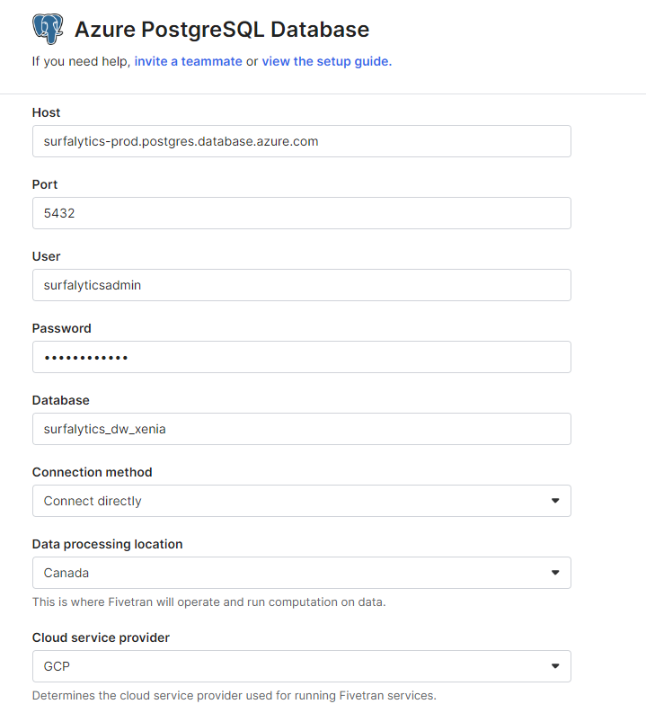
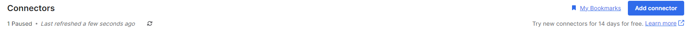

# Dimensional Modeling Project with Azure Postgre, dbt Core and Looker

1. [Week1](Week 1) Clone the repo and access it using VS code
2. [Week2](Week 2) Load data to PostgreSQL
3. [Week3](Week 3) Build models using dbt Core
4. [Week4](Week 4) Add pre-commit and compare dbt strategy vs dbt

## Week 1  Create a new git repository and new branch

1. Create a New Repository
Using GitHub (or another hosting service):
Log in to GitHub (or your preferred hosting service).
Click on the “+” icon in the upper-right corner and select “New repository.”
Fill in the repository details:
Repository Name: Enter a name for your repository.
Description: (Optional) Add a description.
Public/Private: Choose the visibility of the repository.
Initialize this repository with a README

2. Copy get repo URL
3. in Visual Studio Code open terminal and navigate to directory where you want to save repo
4. Write: git clone 'your URL'
5. Create a new branch using command: git checkout -b <your-branch-name>
6. Edit Readme.md file with steps you made, don't forget to save file
7. Push all changes (run commands below) and create pull request (PR) for these changes (go to your repo on Github):
    git add .
    git commit -m "<your-comment>"
    git push origin <your-branch-name>

## Week 2  Load data into Database
Database could be Snowflake, or Postgres. In this case, it would be Postrges on Azure

1. Connect to Postgres database using DBeaver:
    Open DBeaver
    Click on the New Database Connection button.
    Select PostgreSQL from the list of database drivers and click Next.
    Enter the connection details
        - Host: your-db-host
        - Port: your-port
        - Database: your-db-name
        - Username: your-db-user
        - Password: your-db-password
    Click Test Connection to ensure that the connection details are correct. Click OK to save the connection. DBeaver

2. Create schema in new database:
   CREATE SCHEMA raw;

__ETL process__
The ETL (Extract, Transform, Load) process is handled by Fivetran. The process involves extracting data from source (in our case the data is in Excel files that are located in Google Drive folder), transforming it into the desired format, and loading it into the PostgreSQL database on Azure.

 Log in Fivetran
   Need firstly set up destination:
    
   In connectors, click on Add conector 
   In search line, select your source, in this case: Google Drive
   Paste schema we created before - raw and  
   CLick on Save test

Go back to DBeaver and refresh schema with F5 or right click and you will see 
Run the following queries to check the loaded data:
            ```select count(*)
            from raw.orders_xls_orders o;
            select count(*)
            from raw.people_xls_people p;
            select count(*)
            from raw.returns_xls_returns r;```

## Week 3 Build models using dbt Core
__Setup dbt Core and create new dbt project __ (see this [link](https://docs.getdbt.com/docs/core/pip-install)
1. Create new virtual environment
 ```python -m venv dbt-env              # create the environment```
2. Activate virtual environment
```dbt-env\Scripts\activate             # activate environment```
3. Use the following command to install dbt core and dbt database adapter to connect to Postgres:
```python -m pip install dbt-core dbt-postgres```
4. Run the project
```dbt init dbt_superstore```
5. Make connection dbt with database: 

__Create tables in stg schema__
Using SQL editor, create tables with sql [query](SQL/create_tables.sql)

__Create dev and prod environment in profiles.yml file__
***Make sure that views will be created in stg schema
dbt_superstore:
  outputs:
    dev:
      dbname: SURFALYTICS_DW_XENIA
      host: surfalytics-prod.postgres.database.azure.com
      pass: **** put your password
      port: 5432
      schema: stg
      threads: 1
      type: postgres
      user: surfalyticsadmin
    prod:
      bname: SURFALYTICS_DW_XENIA
      host: surfalytics-prod.postgres.database.azure.com
      pass: **** put your password
      port: 5432
      schema: stg
      threads: 1
      type: postgres
      user: surfalyticsadmin

## Week 4
We can use the pre-commit framework to add pre-commit hooks for checking our YAML files and models for linting in a dbt project.
Create a new branch using git checkout command.
Activate your virtual environment (if it was deactivated).
Install pre-commit:
```pip install pre-commit```
Create a .pre-commit-config.yaml file in the root of your local repo
Install the pre-commit hooks:
```pre-commit install```
Run the hooks on all files (optional but recommended for the first time):
```pre-commit run --all-files```
Add all changes and commit to the remote repo. Push your feature branch.

## Week 5
1. Make sure you have DEV and PROD profile and you can run in Dev and in Prod model. To check, run in terminal:
```dbt run --target=prod```

2. Add freshness test in  in the sources.yml and run command dbt source freshness to check. To find out [more](https://docs.getdbt.com/reference/resource-properties/freshness)
   In source.yml file add:
   ```loaded_at_filed:'your column' ```
   ```freshness:
            warn_after: {count: 6, period: hour}```   
    Run
```dbt source freshness```

3. DBT tests 
Data tests are assertions you make about your models and other resources in your dbt project.  When you run dbt test, dbt will tell you if each test in your project passes or fails.
There are singular and generic data tests, find [more](https://docs.getdbt.com/docs/build/data-tests)

   ### Singular data tests
   simple SQL query that returns failing row. Should be created .sql in Test folder.

   Example: try to get rows with sales amount < 0.
       Create sales_amount_is positive.sql in Test folder
       Inside, write code:
       ```SELECT
         sales
         FROM {{ ref('stg__orders') }}
         WHERE sales < 0```
       Run ```dbt test``` 

   ### Generic data tests
   they can be reused over and over again. A generic data test is defined in a test block, which contains a parametrized query and accepts arguments.
     -In macros folder, create new folder 'Tests'
     -In Tests folder, create new files: 'test_positive_values.sql', 'test_not_null_values.sql', 'test_unique_values'
     -In files, we need to write SQL code: 
      ```sql
      -- macros/test_not_null_values.sql

      
            SELECT *
            FROM {{ model }}
            WHERE {{ column_name }} IS NULL
      
      
      ```sql
      -- macros/test_not_positive_values.sql

     
            select *
            from {{ model }}
            where {{ column_name }} < 0
    
    
      ```sql
      -- macros/test_unique_values.sql
          
    
          SELECT {{ column_name }}
          FROM {{ model }}
          GROUP BY {{ column_name }}
          HAVING COUNT(*) > 1
    
I 
  -In the schema.yml file, you need to define your model and add the necessary tests to the columns you want to validate.Look ()

  - In terminal, run dbt test

  

         


    
